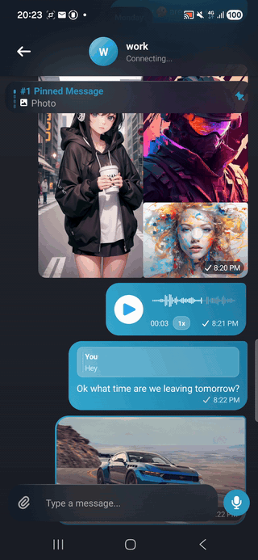
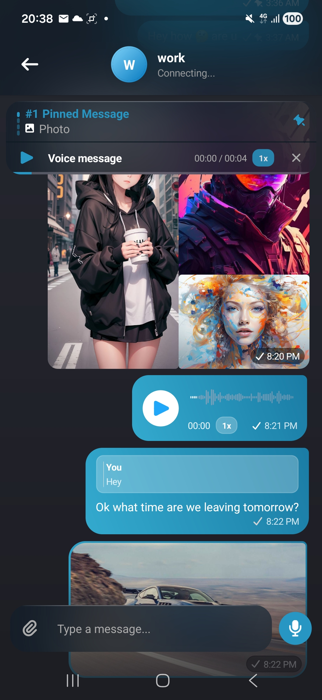

# VitrumMAUI


**Vitrum** *(Latin: glass)* — GPU-accelerated frosted-glass backdrop blur for .NET MAUI.
Zero-CPU acrylic blur, glass blur, and backdrop blur on Android, powered by the native `RenderNode` + `RenderEffect` pipeline.

> Keywords: `maui blur` `acrylic blur` `glass blur` `backdrop blur` `frosted glass` `acrylic view` `maui acrylic` `android blur` `blur effect maui` `glassmorphism maui`

---

## In the wild — DChat

> **DChat** is an upcoming decentralized, privacy-first messaging app built on blockchain infrastructure — currently in development for Android & iOS.

VitrumMAUI powers every blurred surface in DChat: the action bar, the top panel, and the message input — all blurring a live scrolling message list at 60/120 fps with zero CPU involvement.

<table>
  <tr>
    <td></td>
    <td></td>
    <td></td>
  </tr>
</table>

---

## Why this exists

Every existing MAUI blur library (Sharpnado Acrylic, AcrylicView, etc.) works by capturing a `Bitmap` on the CPU, running a stack-blur pass in software, then uploading it back to the GPU on every frame. On a simple layout that's fine. Open a `CollectionView` loaded with images and the frame rate drops because the blur bitmap is regenerated on the UI thread every time the content scrolls.

The correct approach is to use the Android 12+ `RenderNode` + `RenderEffect` API: record the background content into a `RenderNode`, attach a `RenderEffect.createBlurEffect` directly to that node, and let the GPU driver handle all blurring in hardware with zero CPU involvement. The blurred texture is a GPU resource — it never touches the CPU. The result is smooth 60/120 fps blur even over a fast-scrolling list of images. VitrumMAUI brings that API to .NET MAUI C#.

---

## Platform support

| Platform | Status |
|---|---|
| Android 12+ (API 31+) | ✅ GPU `RenderEffect` + saturation chain, zero CPU |
| Android 9–11 (API 28–30) | ⚠️ Tint-only fallback |
| Android < 9 | ⚠️ Tint-only fallback |
| iOS 26+ / macOS 26+ | ✅ Use Apple Liquid Glass — `UIVisualEffectView` / `.glassEffect()` |
| iOS < 26 / macOS < 26 | ✅ Use `UIVisualEffectView` — built-in, no library needed |
| Windows | 🚧 Not implemented |

iOS and macOS are intentionally not implemented here. Apple introduced **Liquid Glass** in iOS 26 / macOS 26 as a first-party design primitive — the OS itself provides real-time frosted-glass rendering baked into standard controls with zero third-party code required. Shipping a custom blur on top of that would fight the platform and produce an inferior result. Use Liquid Glass on Apple platforms; use VitrumMAUI on Android.

---

## How it works

```
BlurHostView (NativeBlurHostView extends ContentViewGroup)
│
│  DispatchDraw(canvas):
│    1. Pre-fill recording canvas with CaptureBackground color
│    2. Hide all registered BlurConsumerViews (INVISIBLE)
│    3. Record GetChildAt(0) into a RenderNode
│       with RenderEffect = blur(60dp) chained with colorFilter(saturation=2x)
│    4. Show BlurConsumerViews again
│    5. base.DispatchDraw(canvas) — normal draw pass
│
└─ BlurConsumerView (NativeBlurConsumerView extends ContentViewGroup)
     DispatchDraw(canvas):
       1. Draw blur RenderNode at 100% opacity (blurred background)
       2. Draw TintColor rect on top (semi-transparent scrim)
       3. base.DispatchDraw(canvas) — draws children on top
```

The saturation chain (`colorMatrix.setSaturation(2f)`) gives the "glass" look — colours behind the blur pop slightly for a premium frosted effect.

---

## Quick start

### 1. Register

```csharp
// MauiProgram.cs
builder.UseVitrum();
```

### 2. Use in XAML

```xml
xmlns:vitrum="clr-namespace:Vitrum;assembly=VitrumMAUI"
```

```xml
<!--
  BlurHostView wraps ONLY the background content.
  BlurConsumerViews are Grid siblings — never inside the host's subtree.
-->
<Grid>
    <vitrum:BlurHostView CaptureBackground="#FF141420">
        <!-- background content: scrollable list, image, etc. -->
        <CollectionView ItemsSource="{Binding Items}" ... />
    </vitrum:BlurHostView>

    <!-- action bar — floats on top, blurs the content behind it -->
    <vitrum:BlurConsumerView TintColor="#B21F2936"
                             VerticalOptions="Start"
                             HeightRequest="56">
        <Label Text="Title" TextColor="White" ... />
    </vitrum:BlurConsumerView>

    <!-- input bar — floats on bottom -->
    <vitrum:BlurConsumerView TintColor="#B21F2936"
                             VerticalOptions="End"
                             HeightRequest="72">
        <Entry Placeholder="Message..." ... />
    </vitrum:BlurConsumerView>
</Grid>
```

---

## ⚠️ Crash rules — read before using

These are hard constraints. Violating them produces a `SIGSEGV` in `libhwui.so` — an infinite `RenderNode.prepareTreeImpl` recursion that kills the render thread. No exception is thrown; the process just dies.

### Rule 1 — BlurConsumerView must NOT be inside the BlurHostView's content subtree

The blur is captured from `BlurHostView.GetChildAt(0)`. If a `BlurConsumerView` exists anywhere in that subtree (even deeply nested inside a child view), its cached `RenderNode` from the previous frame will contain a reference to `_blurNode`. When the capture re-records `_blurNode`, it embeds that stale RenderNode — which contains `_blurNode` — creating an infinite cycle.

```xml
<!-- ❌ CRASHES — consumer is inside BlurHostView's content child -->
<vitrum:BlurHostView>
    <Grid>
        <CollectionView ... />
        <vitrum:BlurConsumerView ... />   <!-- inside → crash -->
    </Grid>
</vitrum:BlurHostView>

<!-- ✅ CORRECT — consumer is a sibling of BlurHostView -->
<Grid>
    <vitrum:BlurHostView>
        <CollectionView ... />
    </vitrum:BlurHostView>
    <vitrum:BlurConsumerView ... />
</Grid>
```

**Why it crashes even when consumers are marked invisible:**
Before capturing, `BlurEngine` sets all registered consumers to `INVISIBLE`. For consumers that are direct children of the content Grid this is sufficient. But when a consumer is nested inside another view (e.g. a custom bar component), that parent view holds a **stale cached RenderNode** from the previous frame that already contains the consumer's RenderNode → `_blurNode`. Toggling `INVISIBLE` on the consumer does not force the parent to re-record its RenderNode synchronously on the render thread. The stale reference gets embedded into the new `_blurNode` recording. Cycle. Crash.

### Rule 2 — BlurHostView's direct child must not be a BlurConsumerView

`GetChildAt(0)` must return the background content. If the first child is itself a `BlurConsumerView`, the capture creates an immediate cycle.

### Rule 3 — Do not nest BlurHostViews

One `BlurHostView` per visual tree branch. Two hosts in the same tree will fight over the same render pass.

### Rule 4 — BlurConsumerViews inside sibling views are safe

A consumer can live arbitrarily deep inside a sibling of `BlurHostView`. `FindHostHandler` walks up the MAUI element tree and checks each level's siblings, so nesting depth inside a sibling is irrelevant.

```xml
<!-- ✅ SAFE — consumer is deep inside a custom view that is a Grid sibling of BlurHostView -->
<Grid>
    <vitrum:BlurHostView>
        <CollectionView ... />
    </vitrum:BlurHostView>

    <local:MyCustomBar ... />   <!-- internally contains a BlurConsumerView — safe -->
</Grid>
```

---

## Properties

### BlurHostView

| Property | Type | Default | Notes |
|---|---|---|---|
| `BlurRadius` | `float` | `60` | Blur sigma in dp. Increase for heavier blur. |
| `CaptureBackground` | `Color` | `Transparent` | Pre-fills the recording canvas before content. Set to your page background color for a denser frosted base. |

### BlurConsumerView

| Property | Type | Default | Notes |
|---|---|---|---|
| `TintColor` | `Color` | `#661C1C25` | ARGB scrim drawn on top of the blur. Alpha controls opacity. |

---

## TintColor reference

| Value | Effect |
|---|---|
| `#B21F2936` | Dark blue-gray, 70% opacity — recommended for dark theme |
| `#D81F2936` | Same, 85% opacity — denser dark theme |
| `#B2FFFFFF` | White frost, 70% opacity — light theme |

Draw order: blur at 100% first, then tint scrim on top. With `#B21F2936` (alpha=0xB2): 30% of the blurred content shows through the 70% scrim.

---

## License

MIT
